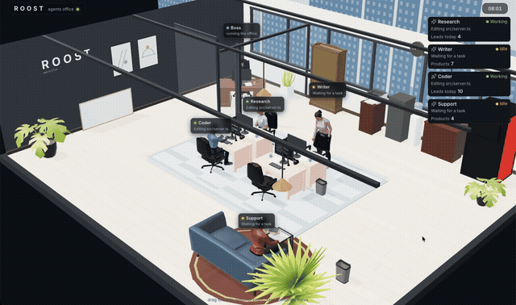
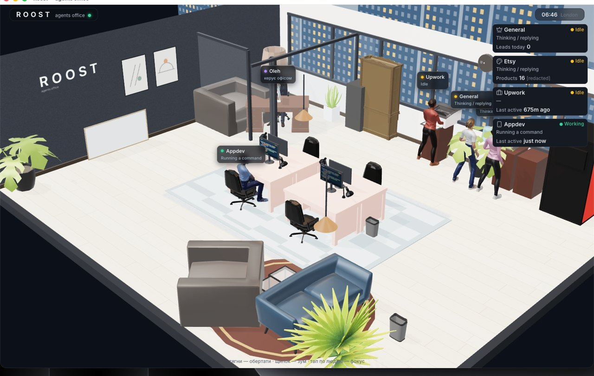
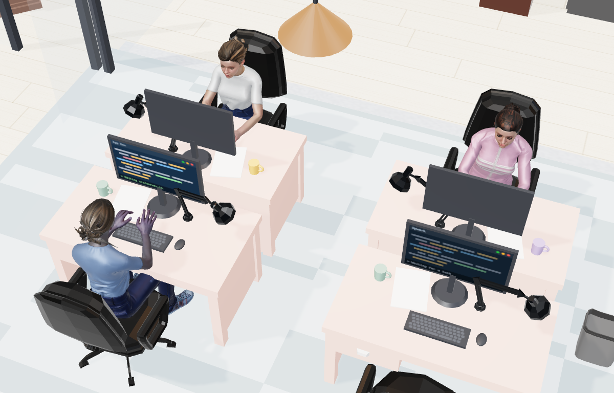
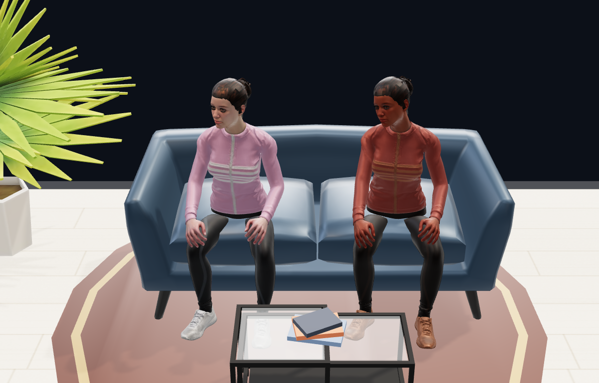
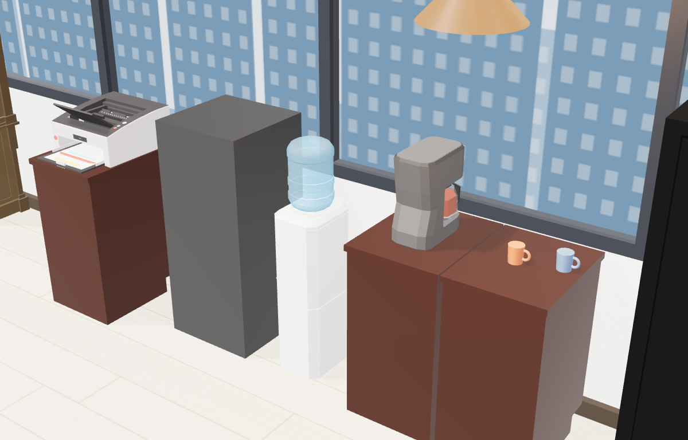
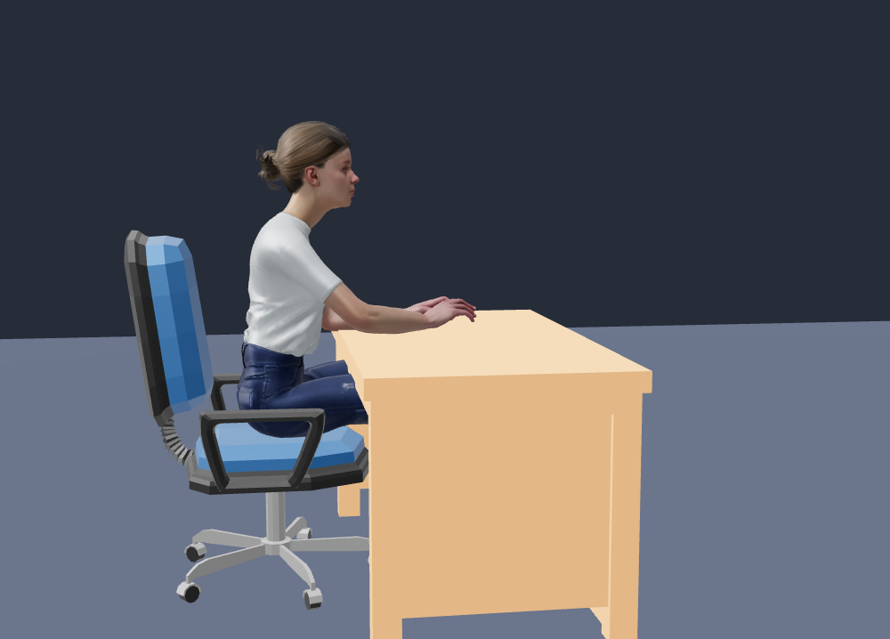

# Roost — a live 3D office for your Claude Code agents

Your AI agents, working in a little office you can actually watch.

Roost reads the activity of up to four [Claude Code](https://claude.com/claude-code)
agents running on your machine and renders them as characters in a real-time 3D
office: whoever is working sits at their desk and types (their monitor shows what
they're doing right now), idle agents get up, grab water, and wait on the couch —
and when two of them are free, they sit together and chat. Agents that go offline
walk out of the office. The boss patrols.



It is a **read-only dashboard**: Roost watches transcript files and (optionally)
tmux — it can never send input to, stop, or otherwise control an agent.



## What the characters do

| Agent status | In the office |
|---|---|
| `working` (transcript active in the last ~25s) | sits at their desk and types; the monitor glows with their **live activity label** |
| `online-idle` (alive, no current task) | stands up, walks to the water cooler (paper cup included), looks out the window, then settles on the couch to wait — joining a colleague already there for a chat |
| `offline` | walks out of the office and fades; walks back in when they return |
| `unknown` (source unreadable) | desk stays empty, the HUD card says so |

Plus a boss who types in the glass corner office, takes phone calls by the window,
presents at the whiteboard, and walks the floor checking only on agents who are
actually working.

| | |
|---|---|
|  |  |

## Quick start

You need Node.js 22+ and at least one project where you run Claude Code.

```bash
git clone https://github.com/sorryhumans/roost.git
cd roost
npm run setup                 # installs server + web dependencies
cp roost.config.example.json roost.config.json
$EDITOR roost.config.json     # describe your agents (see below)
npm run build                 # builds the 3D frontend
npm start                     # http://127.0.0.1:7600
```

Open `http://127.0.0.1:7600`. To watch from your phone on the same network:
`HOST=0.0.0.0 npm start` and open `http://<your-machine-ip>:7600`.

There's also a no-setup preview with scripted agents: append `?demo=1` to the URL.

## Configuration

`roost.config.json` lists 1–4 agents (one per desk):

```json
{
  "agents": [
    {
      "id": "writer",
      "name": "Writer",
      "project": "/home/you/projects/blog-agent",
      "tmux": { "session": "agents", "window": "writer" },
      "metric": { "type": "fileCount", "dir": "/home/you/projects/blog-agent/posts", "label": "Posts" }
    },
    { "id": "coder", "name": "Coder", "project": "/home/you/projects/api" }
  ]
}
```

| Field | Required | Meaning |
|---|---|---|
| `id` | yes | short unique id (letters/digits/dashes) |
| `name` | yes | display name on the label + HUD card |
| `project` | yes | absolute path of the directory the agent's Claude Code session runs in — Roost finds its transcripts under `~/.claude/projects` automatically |
| `tmux` | no | if the agent lives in a tmux window, Roost uses window presence to tell *idle* from *offline* precisely |
| `metric` | no | the headline number on the agent's card: `lastActive` (default) or `fileCount` of a directory (e.g. produced artifacts) |

Without `tmux`, Roost infers presence from transcript recency (active within
30 minutes = idle, older = offline).

## How it works

- **Server** (Node + Fastify): a collector loop reads each agent's newest
  Claude Code transcript (`~/.claude/projects/.../*.jsonl`), converts events to
  short labels ("Running a command", "Editing a file", …), and streams the
  normalized state over Server-Sent Events. ~2.5s tick.
- **Web** (Vite + React + three.js): a hand-built 3D office — characters are
  realistic Mixamo-rig humans with retargeted animation clips (typing, walking,
  drinking, sitting, phone calls), driven by a small behavior state machine with
  waypoint pathfinding. Orbit/zoom with mouse or touch; tap a character to focus.
- Live monitor screens are canvas textures redrawn on every status push, a
  day/night cycle follows your local time (the city outside lights up at night),
  and there's a perf watchdog that degrades quality on weak GPUs. No WebGL at
  all? You get a plain card grid.



Seating is calibrated against the actual animation skeleton, so hands land on
the keyboards, not through the desks:



## Privacy & safety

- **Read-only by construction.** The server registers GET routes only; the UI has
  zero command affordances (enforced by a structural test). Roost can render your
  agents — it cannot touch them.
- **Labels, never content.** Raw transcript text never leaves the server: events
  become short labels, and everything is passed through a redactor that scrubs
  token- and phone-shaped strings before serialization.
- **Local-first.** Binds to `127.0.0.1` by default; opt into your LAN with
  `HOST=0.0.0.0`. No telemetry, no external calls.

## Limitations

- Up to **4 agents** (the office has four desks). Extra config entries are rejected.
- The office is a fixed layout; agents are assigned to desks in config order.
- Tested on macOS + Chrome/Safari (including iPhone). WebGPU not required.

## Development

```bash
npm test                      # server (vitest) + web (vitest) suites
npm --prefix web run dev      # Vite dev server (expects the API on :7600)
```

The placement audit runs on every load and prints `[roost-audit]` findings to the
browser console if any furniture overlaps or pokes through a wall. QA helpers:
`?demo=1` scripted agents, `?style=b` light palette, `?cam=px,py,pz,tx,ty,tz`
camera override, `?poi=cooler|couch|window` biases idle agents for screenshots.

## Credits & license

Code is [MIT](LICENSE). Characters and animation clips are Adobe **Mixamo**
content (royalty-free for use in applications; do not extract and redistribute
them as standalone assets). Furniture models are CC0/CC-BY low-poly models from
[poly.pizza](https://poly.pizza) authors — full per-file attribution in
[CREDITS.md](CREDITS.md) and `web/public/models/office/manifest.json`.

---

Made for watching your agents work, because it's weirdly calming.
